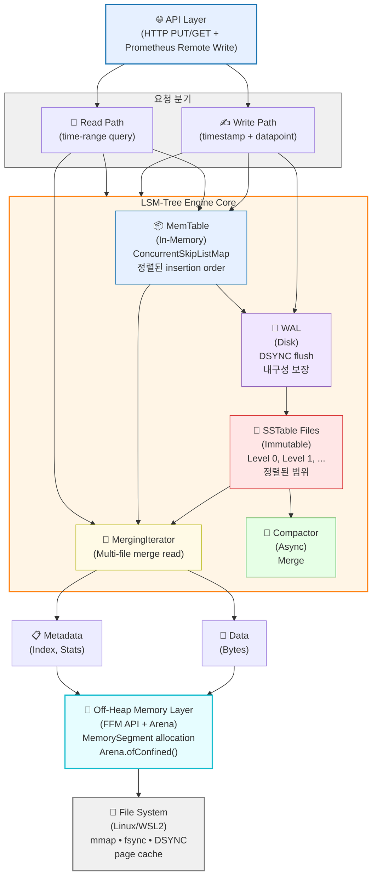

# Kronos 아키텍처 상세

> 이 문서는 Kronos의 계층별 아키텍처와 데이터 흐름을 설명합니다.

---

## 🏗️ 전체 시스템 아키텍처



---

## 📊 데이터 구조별 메모리 레이아웃

### MemTable (In-Memory)

```mermaid
graph TB
    subgraph Heap["Java Heap"]
        ConcurrentSkipListMap["ConcurrentSkipListMap<br/>&lt;Long, Double&gt;<br/>(메타데이터 + 참조만)"]
    end
    
    ConcurrentSkipListMap -->|keys/values 참조| OffHeapArray
    
    subgraph OffHeap["Off-Heap Memory<br/>(FFM API Arena-allocated)"]
        OffHeapArray["MemorySegment Array<br/><br/>Entry 1: [TS₁: 8B | Val₁: 8B]<br/>Entry 2: [TS₂: 8B | Val₂: 8B]<br/>Entry N: [TSₙ: 8B | Valₙ: 8B]"]
    end
    
    OffHeapArray -->|Arena.close()| GCFree["✅ GC 영향 제로<br/>메모리 즉시 해제"]
    
    MetaInfo["<b>메모리 정보</b><br/>크기: N × 16 bytes<br/>수명: MemTable 생성 ~ flush<br/>GC: Zero (명시적 해제)"]
    
    style Heap fill:#e6f0ff,stroke:#1f77b4,stroke-width:2px
    style OffHeap fill:#e6fdff,stroke:#17becf,stroke-width:2px
    style ConcurrentSkipListMap fill:#fff0e6,stroke:#ff7f0e
    style OffHeapArray fill:#e6ffe6,stroke:#2ca02c
    style GCFree fill:#ffe6e6,stroke:#d62728
    style MetaInfo fill:#f0f0f0,stroke:#666
```

### SSTable (Disk + mmap)

```
SSTable File Layout:

┌───────────────────────────────────────────┐
│ Magic (4B)     : 0x4B524E50 ('KRNP')      │
├───────────────────────────────────────────┤
│ Version (4B)   : 1                        │
├───────────────────────────────────────────┤
│ Entry Count (8B) : N                      │
├───────────────────────────────────────────┤
│ Min Timestamp (8B)                        │
├───────────────────────────────────────────┤
│ Max Timestamp (8B)                        │
├───────────────────────────────────────────┤
│ Index Offset (8B) ← [Phase 2] sparse index┤
├───────────────────────────────────────────┤
│ Metadata (TBD)                            │
├───────────────────────────────────────────┤
│                                           │
│  [Data Block]                             │
│  Sorted entries:                          │
│  [TS₁:8B][Val₁:8B][TS₂:8B][Val₂:8B]...  │
│                                           │
│  (Sparse Index Block) — Phase 2           │
│  [Index Key 1] [Offset 1]                │
│  [Index Key 2] [Offset 2]                │
│  ...                                      │
│                                           │
├───────────────────────────────────────────┤
│ CRC32 (4B)                                │
└───────────────────────────────────────────┘

Read Path:
1. mmap으로 파일 로드 (MemorySegment)
2. SSTableMeta.overlaps() → 필요한 파일만
3. SSTableReader.scan(start, end)
   → [Phase 1] 전체 스캔 (O(n))
   → [Phase 2] sparse index 활용 (O(log n) + O(k))
```

---

## 🔄 쓰기 경로 (Write Flow)

```
PUT /metrics?ts=1234567890&value=42.5

           │
           ▼
┌──────────────────────┐
│ HTTP Handler         │
│ (Parse TS + Value)   │
└──────────┬───────────┘
           │
           ▼
┌──────────────────────────────────────┐
│ LsmEngine.put(timestamp, value)      │
│ - Lock MemTable write mutex          │
│ - Get current MemTable              │
└──────────┬───────────────────────────┘
           │
      ┌────┴────┐
      │          │
      ▼          ▼
┌──────────┐  ┌────────────────────┐
│ MemTable │  │ WAL (Write-Ahead   │
│.put()    │  │ Log)               │
│          │  │ .append()          │
│ Skip-    │  │ + fsync(DSYNC)     │
│ ListMap  │  │                    │
│ insert   │  │ ← 내구성 보장      │
└──────────┘  └────────────────────┘
      │          │
      └────┬─────┘
           │
           ▼
┌──────────────────────────────────────┐
│ MemTable Size Check                  │
│ if (size > MAX_SIZE)                 │
└──────────┬───────────────────────────┘
           │
      ┌────┴─────────────────┐
      │ (true)               │ (false)
      ▼                      ▼
┌──────────────┐      ┌─────────────┐
│ freeze()     │      │ Return OK   │
│ (Roll new    │      └─────────────┘
│  MemTable)   │
└──────┬───────┘
       │
       ▼
┌──────────────────────────────────────┐
│ SSTableWriter.write()                │
│ - Open SSTable file on disk          │
│ - mmap or sequential write          │
│ - Write sorted MemTable data        │
│ - Write metadata + index            │
│ - fsync (durability)                │
└──────┬───────────────────────────────┘
       │
       ▼
┌──────────────────────────────────────┐
│ Compactor (Async Thread)             │
│ - Watch for new SSTables            │
│ - Merge N files → 1 file           │
│ - Update metadata                   │
│ - Delete old files                  │
│ - No write path blocking            │
└──────────────────────────────────────┘

[Metrics]
- MemTable.put: ~100 ns (Java heap operation)
- WAL.append + fsync: ~2.5 ms (fsync cost)
  → Throughput: ~400 ops/s (durable)
- MemTable only: ~100 ns × 1000 = 100 μs
  → Throughput: ~9.47 M ops/s (non-durable)
- End-to-End (put + flush): ~30.6 ms / 100k entries
  → Throughput: 3.27 M ops/s
```

---

## 🔍 읽기 경로 (Read Flow)

### Point Query

```
GET /metric?ts=1234567890

       │
       ▼
┌──────────────────────┐
│ HTTP Handler         │
│ (Parse TS)           │
└──────────┬───────────┘
           │
           ▼
┌──────────────────────────────────────┐
│ LsmEngine.get(timestamp)             │
└──────────┬───────────────────────────┘
           │
      ┌────┴────┐
      │          │
      ▼          ▼
┌──────────┐  ┌────────────────┐
│ MemTable │  │ Read SSTables  │
│.get()    │  │ (in mem/cached)│
│ (Binary  │  │                │
│  Search) │  │ SSTableMeta    │
│          │  │ .overlaps()    │
│ O(log n) │  │ → filter by TS │
└──────┬───┘  │ range          │
       │      │                │
       │      │ For each       │
       │      │ overlapping:   │
       │      │                │
       │      │ SSTableReader  │
       │      │ .get()         │
       │      │ Binary search  │
       │      │ mmap read      │
       │      └────────┬───────┘
       │               │
       └───────┬───────┘
               │
               ▼
        ┌─────────────┐
        │ Return value│
        │ (or null)   │
        └─────────────┘

[Metrics] (Single Point)
- MemTable hit: ~100 ns
- SSTable hit: ~1-10 μs (mmap offset + read)
- Cold start: add page fault
```

### Range Query (Scan)

```
GET /metrics?start=ts1&end=ts2

       │
       ▼
┌──────────────────────────────────────┐
│ LsmEngine.scan(startTs, endTs)       │
└──────────┬───────────────────────────┘
           │
           ▼
┌──────────────────────────────────────┐
│ LsmReadView                          │
│ - Snapshot of current state          │
│ - MemTable + all SSTables            │
└──────────┬───────────────────────────┘
           │
           ▼
┌──────────────────────────────────────┐
│ Build Iterator Heap                  │
│ - MemTable.rangeIterator()           │
│ - For each SSTable:                 │
│   SSTableReader.scan()              │
│   → MergingIterator.addNode()       │
└──────────┬───────────────────────────┘
           │
           ▼
┌──────────────────────────────────────┐
│ MergingIterator                      │
│ - Min heap of file iterators        │
│ - 1. MemTable scan (O(k) where k=%  │
│      of MemTable in range)           │
│ - 2. [Phase 1] SSTable full scan     │
│      (O(n) linear read)              │
│   [Phase 2] SSTable sparse index     │
│      (O(log n) + O(k) block reads)   │
│ - 3. Merge: take min, advance heap  │
│ - 4. User callback invoked per entry │
└──────────┬───────────────────────────┘
           │
           ▼
    ┌─────────────────┐
    │ Stream Results  │
    │ (0..k entries)  │
    └─────────────────┘

[Phase 1 Metrics] (1M entries, 16 combinations)
- files=1, RECENT, 0.01% selectivity:
  p50: 10.2 ms, p99: 21.1 ms ❌ (needs index)
- files=4, RECENT, 0.01% selectivity:
  p50: 2.3 ms, p99: 6.7 ms  ⚠️ (overlaps() helps)

[Phase 2 Goal] (with sparse index)
- target: p99 < 5 ms
- expected: 4-5× improvement
- mechanism: skip to first relevant block via index
```

---

## 💾 Off-Heap Memory 관리 (FFM API)

### Arena 생명주기

```
┌─────────────────────────────────────┐
│ try (Arena arena = Arena            │
│      .ofConfined())                 │
│ {                                   │
│   // MemTable 생성                  │
│   MemorySegment segment =           │
│     arena.allocate(size);           │
│                                     │
│   // 데이터 쓰기 (put/flush)        │
│   segment.setLong(offset, value);   │
│                                     │
│   // 읽기                            │
│   long v = segment.getLong(offset); │
│ }                                   │
│ // ← arena.close() 자동 호출        │
│ // → 오프힙 메모리 즉시 해제        │
└─────────────────────────────────────┘

Design Decision (ADR-001):
- ✅ Arena.ofConfined() : 단일 스레드 쓰기 → 낮은 오버헤드
- ❌ Arena.ofShared() : 멀티스레드 가능 but thread-safe 오버헤드
- ❌ Arena.ofAuto() : GC 연동 → 이 프로젝트 목적에 반함

Lifetime Management:
- MemTable lifetime = Arena lifetime
- flush() 후 close() 호출 → 오프힙 메모리 해제
- 누수 위험: Arena 미close → 메모리 누적
  → 테스트에서 항상 try-with-resources 사용
```

### 메모리 할당 크기 계산

```
MemTable 최대 크기:
- 엔트리당 크기: 16 bytes (Timestamp 8B + Value 8B)
- 최대 엔트리: 100,000
- 총 오프힙 크기: 100,000 × 16 = 1.6 MB

SSTable 오프힙 (mmap):
- 파일 크기: 1.6 MB ~ 16 MB (선택성에 따라)
- mmap MemorySegment: 가상 메모리 매핑 (물리 할당 X)

Sparse Index (Phase 2 예상):
- 블록 크기: 4KB (typical)
- 블록당 인덱스 1 엔트리: 16B (key + offset)
- 1M 엔트리 SSTable: 1M / (4KB / 16B) ≈ 262 인덱스 항목
- 인덱스 오버헤드: ~4 KB (무시할 수준)
```

---

## 🎯 Phase별 아키텍처 진화

### Phase 0 → Phase 1

```
Phase 0:
┌─────────────┐
│ OffHeap     │
│ LongArray   │
└─────────────┘

         ↓ (JMH: 9.47 M ops/s in-memory)

Phase 1:
┌─────────────────────────────────┐
│ MemTable + WAL + SSTable + Compact
│ (LSM-Tree 완전 구현)              │
└─────────────────────────────────┘
         ↓ (JMH: 3.27 M ops/s end-to-end)
```

### Phase 1 → Phase 2

```
Phase 1 (Current):
LsmReadView.scan()
├─ [O(n)] Full scan SSTable
└─ p99: 21.1 ms (너무 느림)

         ↓ (sparse index 추가)

Phase 2 (In Progress):
LsmReadView.scan()
├─ [O(log n) + O(k)] Binary search in index
│  ↓ Skip to first relevant block
│  ↓ Linear scan within range
└─ p99 target: < 5 ms (4-5× improvement)
```

---

## 🔐 동시성 모델 (Concurrency)

### Write Path (Single-Threaded, by Design)

```
[Thread 1 - Write API]
├─ HTTP Handler (external lock)
├─ LsmEngine.put() (serialize writes)
└─ MemTable.put() (ConcurrentSkipListMap safe)

[Thread N - Compaction] (Independent)
├─ Async compactor task
├─ Merge SSTables
└─ No contention with writes
```

**이유**: TSDB 워크로드는 write-heavy single-sequence (e.g., Prometheus remote write).  
멀티스레드 write는 불필요한 complexity. 수평 확장은 shard-per-engine.

### Read Path (Concurrent)

```
[Thread A - Read 1]
├─ LsmReadView.snapshot()
├─ Scan MemTable + SSTables
└─ Return iterator/stream

[Thread B - Read 2] (동시 진행 가능)
├─ LsmReadView.snapshot()
├─ Scan MemTable + SSTables
└─ Return iterator/stream

[Thread Write] (동시 진행 가능)
├─ MemTable 업데이트 (next MemTable)
├─ Compaction 실행
└─ No reader blocking
```

---

## 📈 확장성 고려사항 (Future)

### Horizontal Scaling

```
┌──────────┐  ┌──────────┐  ┌──────────┐
│ Kronos 1 │  │ Kronos 2 │  │ Kronos 3 │
│ shard=A  │  │ shard=B  │  │ shard=C  │
└─────┬────┘  └─────┬────┘  └─────┬────┘
      │             │             │
      └─────────────┼─────────────┘
                    │
            ┌───────▼────────┐
            │ Query Broker   │
            │ (Aggregate)    │
            └────────────────┘
```

현재: 단일 engine 성능 최적화 우선

### Vertical Scaling

- **CPU**: Single write thread로 제한, 하지만 reads/compaction은 병렬
- **Memory**: 오프힙 → GC 압력 없음 → 메모리 충분하면 무한정 확장 가능
- **Disk**: I/O 병목 가능성 (compaction fsync)
  - 해결책: NVMe SSD 또는 sharding

---

## 🧪 아키텍처 검증 방법

### 1. Correctness Testing

- `CompactorTest.hundred_thousand_entries_survive_compaction` — 정합성
- Invariant: write order = read order (after any combination of flush + compact)

### 2. Performance Benchmarking

- JMH로 각 operation 측정
- 상대 비교: Phase N vs Phase N-1
- 절대 기준: throughput/latency 목표 달성

### 3. GC Impact Zero Verification

```bash
./gradlew test -XX:+PrintGCDetails 2>&1 | grep "GC"
# ← 결과가 없어야 함 (Young GC = 0, Old GC = 0)
```

---

## 참고: JVM 플래그

```bash
# FFM API 활성화 (필수)
--enable-preview
--enable-native-access=ALL-UNNAMED

# 성능 최적화 (권장, 벤치마크용)
-XX:+UseZGC                    # Low-latency GC (하지만 off-heap이라 불필요)
-XX:+UnlockDiagnosticVMOptions # Diagnostic flags

# 디버깅
-XX:+PrintGCDetails           # GC 로그
-XX:+PrintGCDateStamps
-Xlog:gc*:file=gc.log:level=info:uptime,level,tags
```

