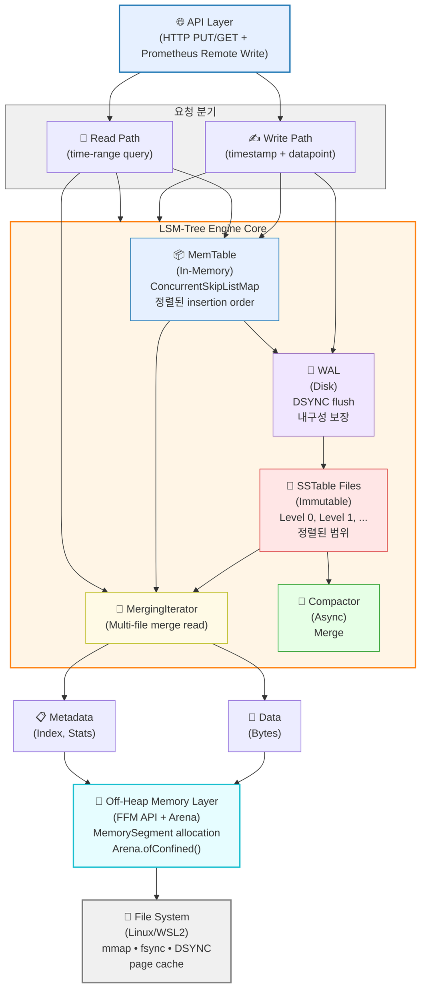
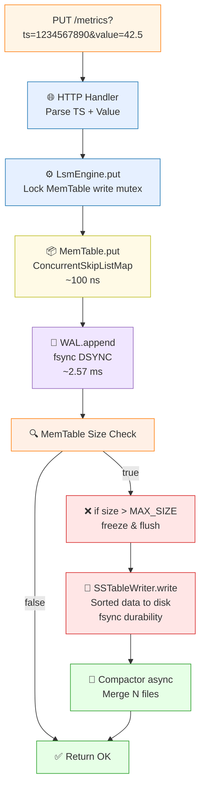
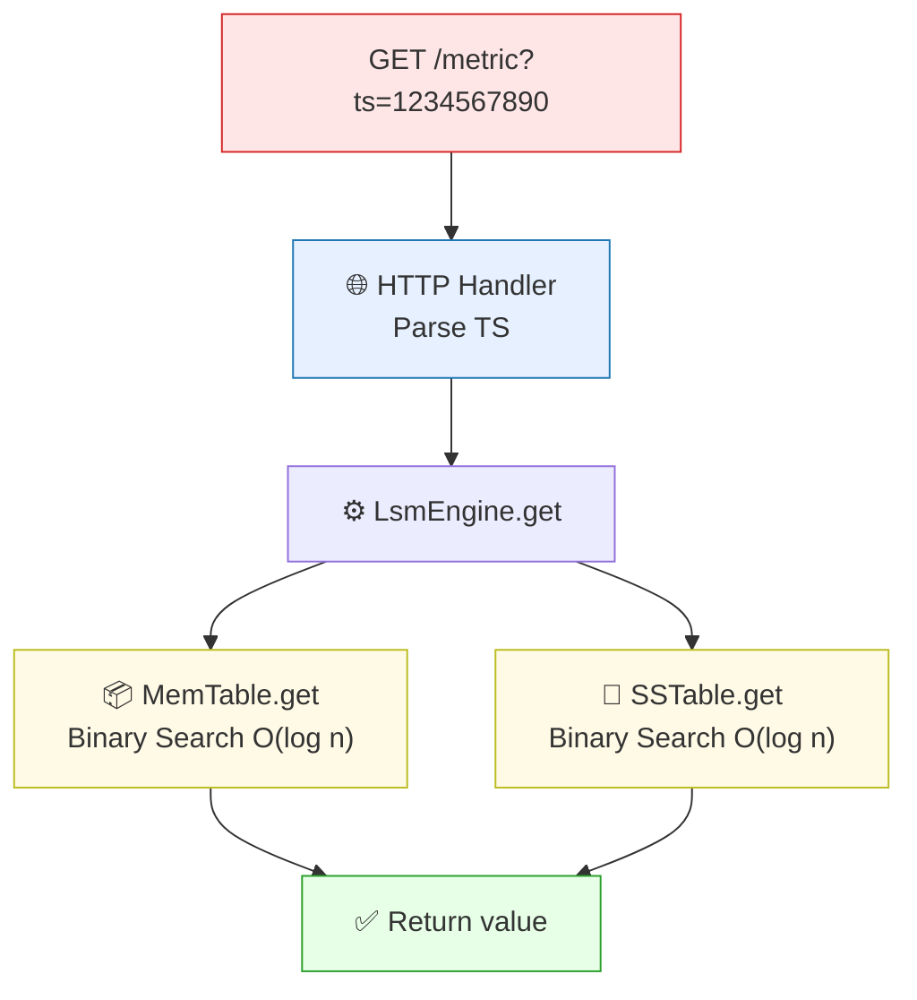
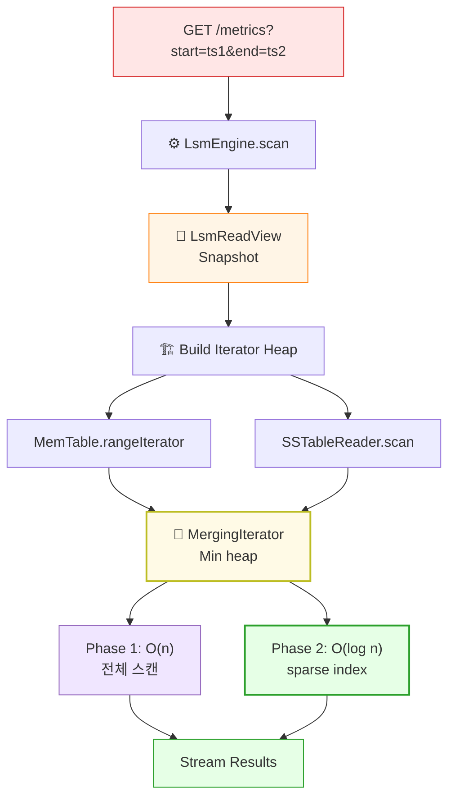
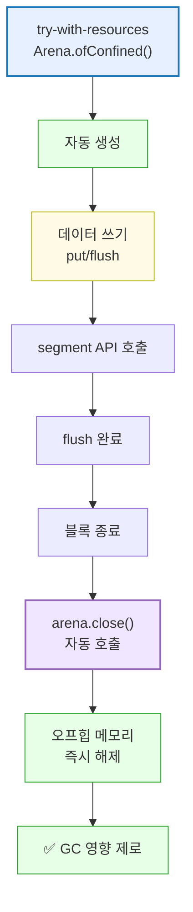
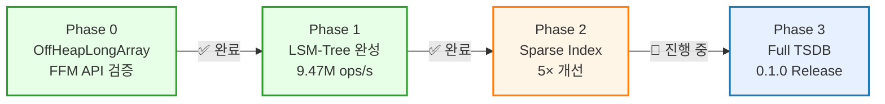
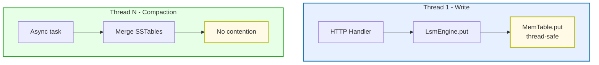
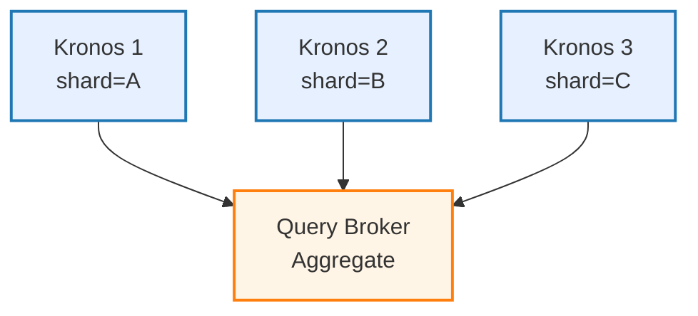

# Kronos 아키텍처 상세 (Mermaid 다이어그램)

> 이 문서는 Kronos의 계층별 아키텍처와 데이터 흐름을 Mermaid 다이어그램으로 설명합니다.

---

## 🏗️ 전체 시스템 아키텍처



---

## 📊 데이터 구조별 메모리 레이아웃

### MemTable (In-Memory)

```mermaid
graph TB
    subgraph Heap["Java Heap"]
        ConcurrentSkipListMap["ConcurrentSkipListMap<br/>&lt;Long, Double&gt;<br/>(메타데이터 + 참조만)"]
    end
    
    ConcurrentSkipListMap -->|keys/values 참조| OffHeapArray
    
    subgraph OffHeap["Off-Heap Memory<br/>(FFM API Arena-allocated)"]
        OffHeapArray["MemorySegment Array<br/>Entry 1: TS₁ 8B | Val₁ 8B<br/>Entry 2: TS₂ 8B | Val₂ 8B<br/>Entry N: TSₙ 8B | Valₙ 8B"]
    end
    
    OffHeapArray -->|Arena.close()| GCFree["✅ GC 영향 제로<br/>메모리 즉시 해제"]
    
    style Heap fill:#e6f0ff,stroke:#1f77b4,stroke-width:2px
    style OffHeap fill:#e6fdff,stroke:#17becf,stroke-width:2px
    style ConcurrentSkipListMap fill:#fff0e6,stroke:#ff7f0e
    style OffHeapArray fill:#e6ffe6,stroke:#2ca02c
    style GCFree fill:#ffe6e6,stroke:#d62728
```

**메모리 정보**:
- 크기: N × 16 bytes (N = MemTable entries)
- 수명: MemTable 생성 ~ flush 완료 후 close()
- GC Impact: Zero (Arena.close() → 오프힙 메모리 해제)

---

## 🔄 쓰기 경로 (Write Flow)



| 구간 | 비용 | 주요 병목 |
|------|------|----------|
| MemTable.put | ~100 ns | Java heap operation |
| WAL fsync | ~2.57 ms | 물리 I/O (지배적) |
| SSTable write | ~30.6ms/100k | 배치 처리로 amortize |

---

## 🔍 읽기 경로 (Read Flow)

### Point Query



**성능**: MemTable hit: ~100 ns | SSTable hit: ~1-10 μs | Cold start: +page fault

### Range Query (Scan)



| 메트릭 | Phase 1 | Phase 2 목표 | 개선율 |
|--------|---------|------------|--------|
| p99 (1% 선택성) | 21.1 ms | < 5 ms | 4-5× |

---

## 💾 Off-Heap 메모리 관리

### Arena 생명주기



---

## 🎯 Phase별 아키텍처 진화



---

## 🔐 동시성 모델

### Write Path (Single-Threaded)



**이유**: TSDB는 write-heavy single-sequence 워크로드. 멀티스레드 write는 불필요.

### Read Path (Concurrent)

모든 읽기 쿼리가 동시에 실행 가능하며, 쓰기 작업과도 경합 없음.

---

## 📈 확장성 고려사항

### Horizontal Scaling (향후)



현재: 단일 engine 성능 최적화 우선

### Vertical Scaling

- **CPU**: Single write thread, reads/compaction은 병렬
- **Memory**: 오프힙 → GC 없음 → 메모리 충분하면 무한정 확장
- **Disk**: I/O 병목 가능 (compaction fsync) → NVMe 또는 sharding으로 해결
